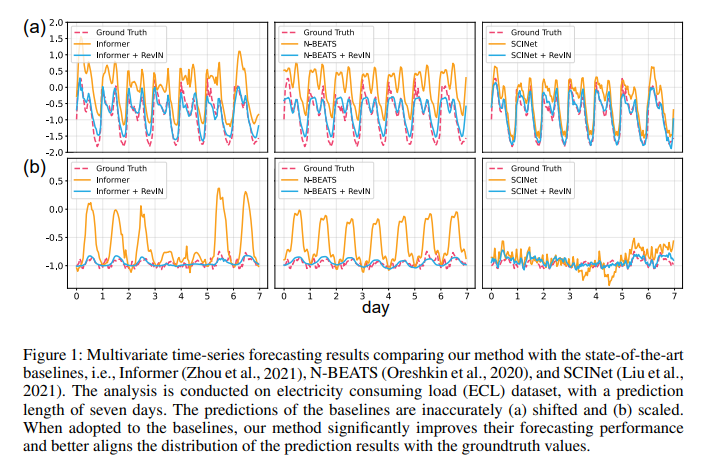

# Reversible-Instance-Normalization
Implementation of RevIN is based on TF2.Keras and PyTorch.

### Reference
RevIN is proposed by this paper: [Reversible Instance Normalization for Accurate Time-Series Forecasting against Distribution Shift](https://openreview.net/forum?id=cGDAkQo1C0p).

### Abstract
Statistical properties such as mean and variance often change over time in time series, i.e., time-series data suffer from a distribution shift problem. This change in temporal distribution is one of the main challenges that prevent accurate time-series forecasting. To address this issue, RevIN proposes a simple yet effective normalization method called reversible instance normalization (RevIN), a generally-applicable normalization-and-denormalization method with learnable affine transformation. The proposed method is symmetrically structured to remove and restore the statistical information of a time-series instance, leading to significant performance improvements in time-series forecasting, as shown in Figs below.



### Quick Start

keras
```python
import tensorflow as tf
from tensorflow.keras import layers
from revin.revin_keras import RevIN

data = tf.reshape(tf.range(0, 24), shape=(4, 3, 2))/24

revinlayer = RevIN()
inputs = layers.Input(shape=(3, 2))
x = revinlayer(inputs, mode='norm')
x = layers.Conv1D(2, kernel_size=1, activation='relu')(x)
outputs = revinlayer(x, mode='denorm')

model = tf.keras.Model(inputs=[inputs], outputs=[outputs])
```

pytorch
```python
import torch
import torch.nn as nn
from revin.revin_torch import RevIN

x = torch.reshape(torch.range(0, 23), shape=(4, 3, 2))/24

revinlayer = RevIN(2)

class Net(nn.Module):
    def __init__(self):
        super(Net, self).__init__()
        self.revinlayer = RevIN(num_features=2)
        self.conv1d = nn.Conv1d(in_channels=2, out_channels=2, kernel_size=1)

    def forward(self, x):
        x = self.revinlayer(x, mode='norm')
        x = self.conv1d(x)
        x = nn.ReLU(x)
        x = self.revinlayer(x, mode='denorm')
        return x
```

### Conclusion

Just interested in the first implementation and welcome to test and ask questions.

### Acknowledgments

* [HyperTS](https://github.com/DataCanvasIO/HyperTS): A Full-Pipeline Automated Time Series (AutoTS) Analysis Toolkit.
* [RevIN](https://github.com/ts-kim/RevIN): The official PyTorch implementation.